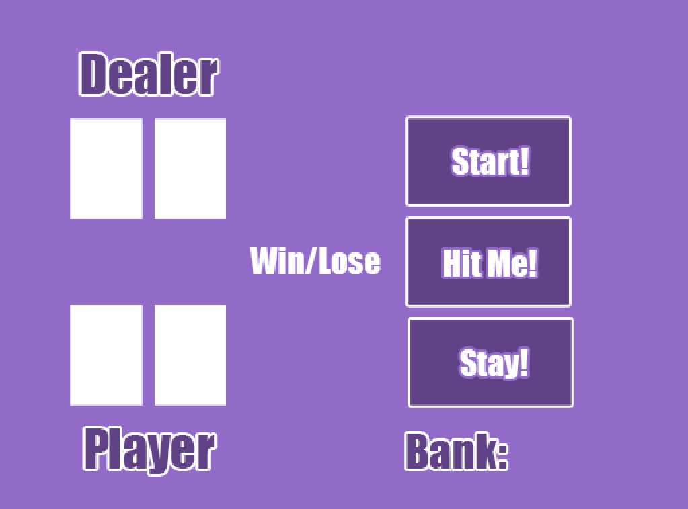
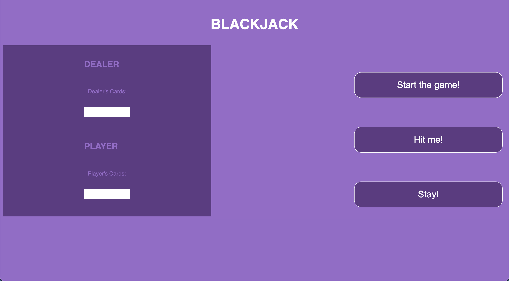
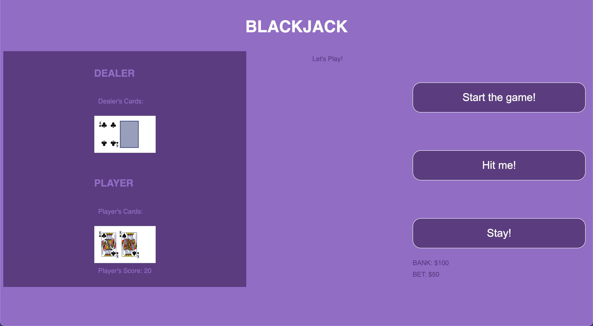
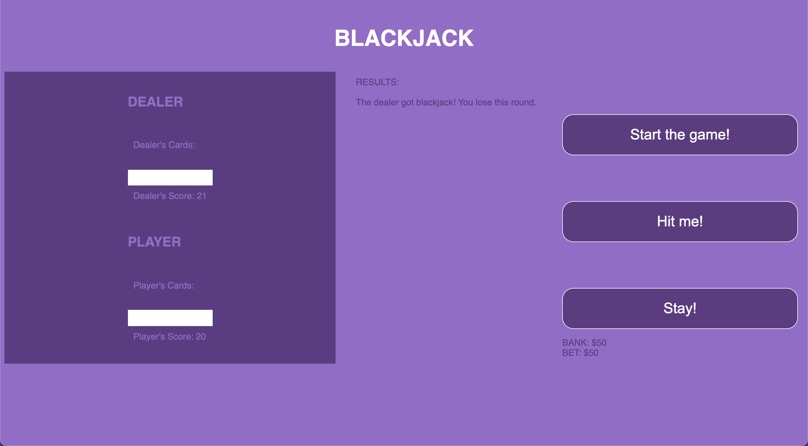

# Blackjack 

## About 

For my first project in this course, I chose to build the game of Blackjack in the browser. It was a challenging experience and really showcased the amount of logic and understanding that goes into building a game even as simple as Blackjack.  

Blackjack, also commonly known as 21, is a popular card game in which the goal is to either land on the score of 21 or as close to it as possible without going over using the value of cards. Players compete against the dealer, and the first hand draws two cards for each player, as well as the dealer. The player can **hit** or ask for another card until they reach a number they like at which point they **stay**. The dealer usually has a *soft* number, which if they do not reach, they must draw a card. In this iteration, the soft number is 18. If either the dealer or player gets to the value of 21, they've hit **blackjack** and win the game. If they go over 21, they **bust** and lose the hand.  

## Wireframe

## Game in Action

 

## Technologies Used

This game utilizes HTML, CSS, and Javascript.

## Getting Started 

The game can be played here: [Blackjack](https://aromeekim.github.io/project1)

It is fairly simple with three buttons: start, hit, and stay. Start will initialize the round, hit will push another card into the player's deck, and stay will end the game and check for the winner. 

## Icebox Features

Future enhancements to the game would include following the casino rules for Blackjack more closely, such as utilizing more than one deck of cards, having a burn card at the start of each round, and allowing for adjustable bets. I would also change the value of the Ace card to be either 1 or 11, depending on its benefit to the player/dealer as occurs in a real game of Blackjack.

There is a lot to be desired design-wise so I would also make the game much more aesthetically pleasing and possibly themed, as well as more responsive. 